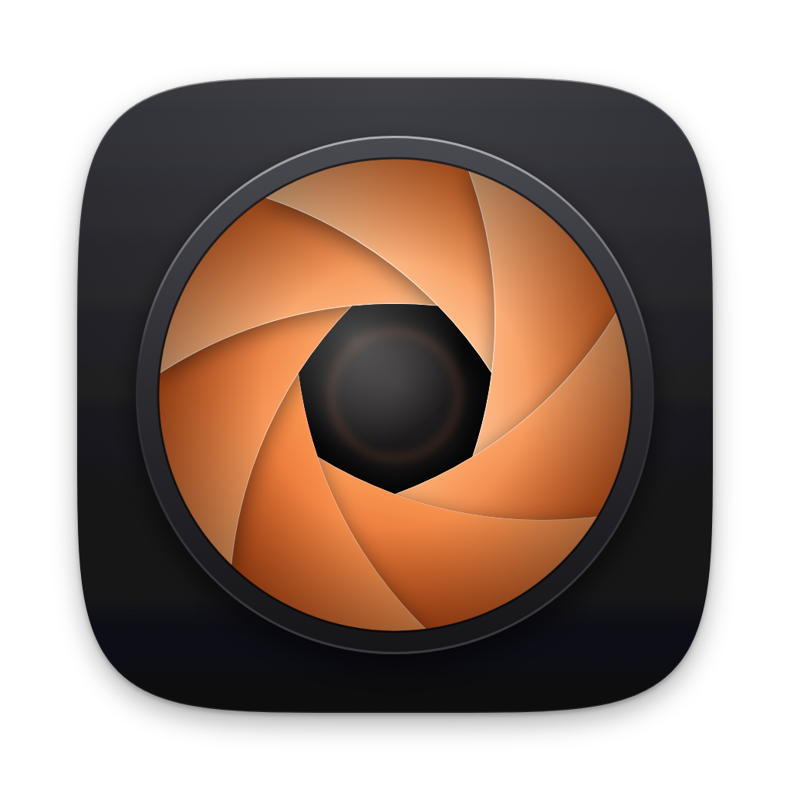
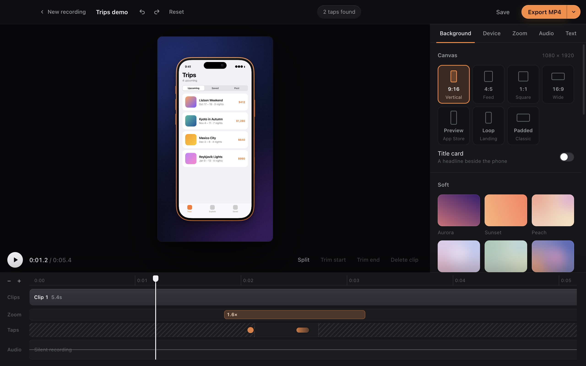

<div align="center">



# OpenScreen

**Polished iPhone, iPad and Mac demo videos — recorded, edited and exported in minutes.**

[](https://github.com/tszaks/openscreen/releases/latest)

[](https://github.com/tszaks/openscreen/releases/latest)
[](https://github.com/tszaks/openscreen/actions/workflows/ci.yml)
[](LICENSE)


</div>

<p align="center">
  
</p>

OpenScreen is a free, open-source screen recorder for Mac, built for app demos. Plug in an iPhone with a cable and record it, or record your Mac's screen. OpenScreen finds every tap, zooms in where the action is, frames the device and exports a video that's ready for the App Store, social media or your website.

## Features

**iPhone and iPad, over a cable**
- Record a wired iPhone or iPad with a live preview. The status bar switches to Apple's clean 9:41 demo look while you record.
- **Automatic tap detection.** Taps, swipes, long presses and typing are found from the video itself and shown as ripples you can move or remove.
- **Zoom to tap.** The camera glides in on each tap and back out once the screen settles.
- **Device frames** for current iPhone and iPad models, in their real finishes. The model is detected from the recording.

**Mac screen recording**
- Record a display or a window, with your microphone and an optional camera overlay.
- Smooth auto-zoom on clicks and where your cursor lingers, with natural easing.
- Cursor smoothing, click ripples and a keystroke overlay.

**A full editor**
- Split, trim, reorder and change the speed of clips. Undo everything.
- A resizable workspace and a zoomable timeline — pinch to work down to a fraction of a second.
- 24 backdrops, plus your own images or desktop wallpaper.
- Captions with on-device transcription, transcript editing, and smart cutting of silences and filler words.
- Right-click menus, project naming, and a one-step reset back to the original recording.

**Export anywhere**
- App Store previews at Apple's exact specs (886 × 1920, 30 fps).
- Reels, TikTok and Shorts (9:16), feed (4:5), square and widescreen layouts, with optional title cards.
- Looping landing-page videos (MP4 + WebM + poster) and GIFs.
- Several formats in one click.

## Install

1. Download **OpenScreen** from the [latest release](https://github.com/tszaks/openscreen/releases/latest) and drag it to Applications.
2. Open it. It's signed and notarized by Apple, and it keeps itself up to date.

**Requirements:** a Mac with Apple silicon.

**To record an iPhone or iPad:** connect it with a data cable, unlock it, tap **Trust**, and allow Camera access for OpenScreen when macOS asks.

**For captions (optional):** `brew install whisper-cpp`. The speech model downloads automatically the first time.

## Automate it

Everything in the editor can also be driven from the command line, so an agent or a script can record a phone, review the take, edit it and export it without opening a window:

```sh
node electron/scripts/openscreen-agent.mjs record start
node electron/scripts/openscreen-agent.mjs record stop
node electron/scripts/openscreen-agent.mjs polish latest --style clean
node electron/scripts/openscreen-agent.mjs export latest --out demo.mp4
```

Every command prints one JSON object. See [AGENTS.md](AGENTS.md) for the full reference.

## Build from source

```sh
git clone https://github.com/tszaks/openscreen.git
cd openscreen/electron
npm install
npm test               # unit tests
npm run electron:dev   # build and launch
```

You'll need Node.js 20 or later, and Xcode's command line tools (`xcode-select --install`) for the iPhone capture helper. For exports during development, install ffmpeg (`brew install ffmpeg`); release builds bundle it.

How it fits together: [docs/ARCHITECTURE.md](docs/ARCHITECTURE.md).

## Contributing

Bug reports, ideas and pull requests are welcome — please read [CONTRIBUTING.md](CONTRIBUTING.md) first. To report a security issue, see [SECURITY.md](SECURITY.md).

## License

[MIT](LICENSE) © Tyler Szakacs
